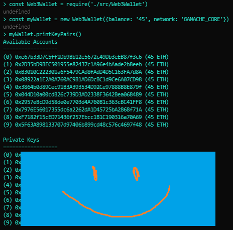
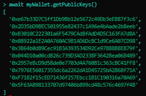
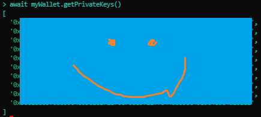
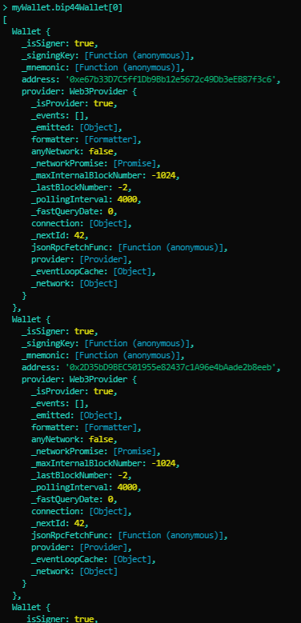
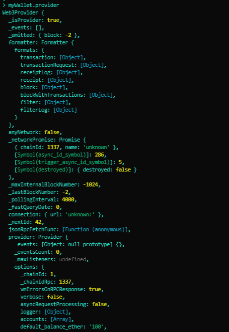

# Web3 Wallet Utils
A developing collection of Web3 wallet utilities. 

## Dependencies
<a href="https://github.com/motdotla/dotenv.git/">

## Setup and Installation Guide
  1. Clone the GitHub repo at <a href="https://github.com/jasonjgarcia24/web3-wallet-utils.git" target="_blank">https://github.com/jasonjgarcia24/web3-wallet-utils.git</a>.
  2. In the root path, run <code>npm init -y</code>.
  3. In the root path, run <code>npm i</code>
      - Ensure the listed dependencies in <a href="package.json" target="_blank">package.json</a> have been successfully installed.
      
## Usage
#### Printing Key Pairs:
 

#### Printing Public Keys:
 

#### Printing Private Keys:
 

#### Web3Wallet.bip44Wallet:
 

#### Web3Wallet.provider:

